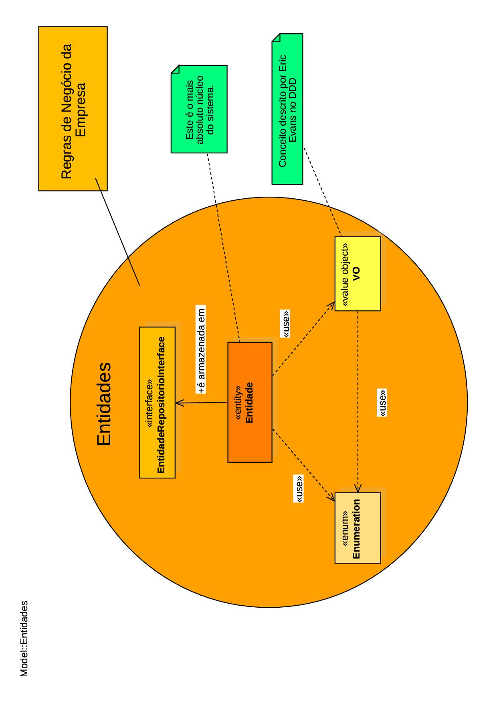

# Aplicativo Imperial Personal Finance
<a href='https://github.com/ArmandoNunesTrader/imperial-personal-finance' target="_blank"></a>

Aplicativo de Finanças Pessoais desenvolvido em Python 3.12 utilizando conceitos de Clean Architecture e DDD.


# Comentários
        
A idéia deste aplicativo é ter algum produto prático que materialize a minha evolução no aprofundamento do aprendizado da linguagem **Python** e que sirva de material de pesquisa aos que estão iniciando ou mesmo, querendo uma outra perspectiva prática da aplicação dos conceitos de ***Clean Architecture*** e ***DDD***.

Existem várias formas de se aplicar os conceitos da ***Clean Architecture*** e do ***DDD***, visto que eles são linhas de ação e estratégias, e não orientações rígidas sobre o "como" fazer.

A abordagem que utilizo aqui é a minha proposta para a sua utilização, usando o **Python** como ferramenta.
Longe de pretender ser a melhor, é a minha, é a que eu me proponho a utilizar.

Eu acredito que a melhor forma de desenvolver os produtos usando esses dois conceitos, e se manter fiel a eles, é começar de dentro para fora.

Investir mais tempo no núcleo do negócio e do sistema, que normalmente é também, o que encapsula e resolve as necessidades dos stakeholders e proporciona ganho ao negócio.

E, enquanto avançamos no processo de desenvolvimento, se nos depararmos com uma necessidade específica de um recurso que não temos ainda disponível, é hora de rever as fronteiras que estabelecemos. 

Não se pode depender, numa camada interna, de algo que ainda não temos. 

Se não temos, ou não usamos, ou abstraímos, simples assim.

Neste simples **Sistema de Finanças Pessoais**, alguns pontos eu também preciso explicar e salientar.

Um deles é que tentei evitar ao máximo o uso de frameworks. Nada como um puro suco de frutas em detrimento de suco de caixinha com imensa quantidade de conservantes e adoçantes que não escolhemos consumir e não sabemos o bem, ou principalmente o mal, que poderão nos causar no futuro.

Mas sem radicalismos. 

Não se precisa reinventar a roda.

Outro ponto é que uso UUID's tipo 4 como chaves primárias. Essa escolha tem vantagens e desvantagens.

A principal vantagem é que quando de uma requisição GET em um browser, corremos o risco de expor a id de um produto/cliente/artigo etc. 

Muitas empresas não percebem que expondo a id, dão margem à concorrência para descobrir algumas informações relevantes. Por exemplo. Se uma empresa tem 10 anos de mercado e numa requisição GET eu vejo algo do tipo

```
.../cliente_list/10000... 
```

seria razoável pensar que ela obtém um crescimento médio de 1000 clientes ao ano. Isso pode ser evitado com o uso de UUID's como chave primária caso seja necessário expô-la como query params.

A desvantagem é que o armazenamento de UUID's (mesmo comprimidas como hexa) consome mais recursos que a de um inteiro (tradicionalmente usado nos campos auto-incremento). E as UUID's tipo 4 não tem 100% de garantia de unicidade, embora a probabilidade de repetições seja desprezível. 

E, sendo maior, também consome mais tempo de leitura/escrita. No entanto, essas questões pesam mais em grandes volumes de dados. Neste sistema, esses pontos não são tão impactantes no todo. Por isso a minha opção em usá-los.

Mas, sugiro a seguinte avaliação: grandes volumes de dados e de leitura/escrita, use auto-incremento tradicional; pequenos volumes aonde pode ser interessante ocultar o máximo de informações, considere o uso de UUID's.

Aqui optei pelas UUID's também pela questão didática.

Outro ponto que devo mencionar é que uso testes. Sei que pode ser por vezes chato, monótono e maçante desenvolver. 

Afinal, vamos deixar de construir maravilhosos e elaborados algoritmos que nos desafiam, para poder usar o tempo para inserir centenas de asserts. Mas... Se um dia um cliente te acordar de madrugada dizendo que o sistema parou e você tiver de sair correndo para tentar descobrir o que houve, e depois ainda sofrer as consequências emocionais, profissionais e financeiras disso, você vai lembrar do que te digo aqui.

Mas não seja um testador fake. Que cria uma meia dúzia de testes e acha que está implantando TDD. Não faça isso. 

Confesso que ao longo dos meus 40 anos de desenvolvimento, só recentemente adotei os testes com mais intensidade. E como, mea-culpa, tenho uma tendência a ser perfeccionista, procuro cobrir 100% do meu código com testes. Já que vamos fazer, façamos direito. Você vai dizer, "Isso é impossível!".

Calma, a princípio eu tenho tendência a concordar com você. Mas... O que eu faço?

Eu escrevo testes para cobrir o máximo de funcionalidades de código que minha mente pode pensar. Aí, usando o pytest, do **Python**, coloco aquelas três letras mágicas ao final do comando de depuração do código.

```
pytest meu_modulo.py -s -v --cov
```

Ele me entrega um mapa de cobertura do projeto. Em seguida eu digito:

```            
coverage html
```

E em seguida:

```        
py coverage_view.py 
```

>[!NOTE]
>
>Ele é um arquivo que criei \(está na raiz do projeto\) e que abre o browser com o relatório detalhado da cobertua.
        
Posso então trabalhar nos pontos não cobertos.

E quando ao final desse processo, sobram rotinas que não consigo pensar em como testar (por exemplo, erro específico no servidor de banco de dados) eu fico feliz. Pois sei que pensei no tratamento desses erros, mesmo não tendo, a princípio, como testá-los. Aí é hora de colocar ao final da linha, a seguinte string, como comentário:
 
```
# pragma: no cover
```

Ela diz ao pytest para não considerar aquela linha no relatório de cobertura de testes. E temos os tão sonhados 100% de cobertura. Mais tarde, se nossa mente conseguir criar uma forma de testar o que não conseguimos anteriormente, basta implantar os testes e remover a linha com o comentário do pragma e tudo se mantém.

>[!NOTE]
>
>Veja a minha configuração de testes e coberturas no arquivo *.coveragerc* na raiz do projeto.

Por último, cumpre ressaltar que me apaixonei pelo **Python** recentemente. E venho buscando evoluir no seu uso, quer em aplicações Web, quer em modelos matemáticos e estatísticos para ciência de dados. Longe de ser um expert (ainda) na linguagem, sou simplesmente mais um estudioso e entusiasta dela. 

E o que proponho aqui é compartilhar minha evolução no seu estudo e mesclar com minha experiência de desenvolvedor e gestor de projetos pequenos, médios e grandes em várias áreas de negócio desde os primórdios dos primeiros micro-computadores CP-200 (ahhh tempos românticos de CPD) até os sistemas mais robustos de hoje.

E este produto, como um organismo vivo, como são, ou deveriam ser, todos os sistemas e organizações, nunca deixará de evoluir e mudar.

# Material de Estudo da Definição Formal da Clean Architecture e do DDD

Este é o [link](https://blog.cleancoder.com/uncle-bob/2012/08/13/the-clean-architecture.html) para o artigo original do Uncle Bob sobre a **Clean Architecture**.

Se desejar leia o livro [Arquitetura Limpa](https://www.amazon.com.br/Arquitetura-Limpa-Artes%C3%A3o-Estrutura-Software/dp/8550804606) em que Robert C. Martin (apelidado de Uncle Bob) descreve os conceitos.

Para conhecer também os conceitos de DDD descritos por Eric Evans, recomendo três obras.

O livro original onde os conceitos foram sintetizados. [Domain-Driven Design: Atacando as Complexidades no Coração do Software](https://www.amazon.com.br/Domain-Driven-Design-Atacando-Complexidades-Software/dp/8550800651/ref=sr_1_1?crid=30MLEY8XZFK1Q&dib=eyJ2IjoiMSJ9.xUcGVaYMwHJbLbQP15K0eGt_DQvN0qyQ_FIdYGOAx8kN-lRSJDlFD6kjz0-C9AxK28T3G9_4f8IQjnBMsm2sMP1aMA20JQ_zUMo6IYG1T_wQ1suZShzNOMakPpILBE9Z8dJmZmcfnnBzF4RFpr_RCwfjeLmIR60wogDOaHuAoDjlEa909wdLAs1u-pRPf8ltJ9kLZ_buHLbhzn4yJhDlRhto9YKcRAh5qlp5zZrnyck.ijqO68Xz8Q5Uh-uCarOnoIuip4HaQxH-_h0PZyS1h5s&dib_tag=se&keywords=domain+driven+design+eric+evans&qid=1734475495&s=books&sprefix=Eric+Evan%2Cstripbooks%2C235&sr=1-1&ufe=app_do%3Aamzn1.fos.6d798eae-cadf-45de-946a-f477d47705b9).
        
Uma abordagem mais prática está descrita neste outro livro [Implementando Domain-Driven Design](https://www.amazon.com.br/Implementando-Domain-Driven-design-Vernon/dp/8576089521/ref=sr_1_5?crid=30MLEY8XZFK1Q&dib=eyJ2IjoiMSJ9.xUcGVaYMwHJbLbQP15K0eGt_DQvN0qyQ_FIdYGOAx8kN-lRSJDlFD6kjz0-C9AxK28T3G9_4f8IQjnBMsm2sMP1aMA20JQ_zUMo6IYG1T_wQ1suZShzNOMakPpILBE9Z8dJmZmcfnnBzF4RFpr_RCwfjeLmIR60wogDOaHuAoDjlEa909wdLAs1u-pRPf8ltJ9kLZ_buHLbhzn4yJhDlRhto9YKcRAh5qlp5zZrnyck.ijqO68Xz8Q5Uh-uCarOnoIuip4HaQxH-_h0PZyS1h5s&dib_tag=se&keywords=domain+driven+design+eric+evans&qid=1734475495&s=books&sprefix=Eric+Evan%2Cstripbooks%2C235&sr=1-5&ufe=app_do%3Aamzn1.fos.6d798eae-cadf-45de-946a-f477d47705b9).

Se desejar uma abordagem mais sintética, veja o livro [Domain-Driven Design Destilado](https://www.amazon.com.br/Domain-Driven-Design-Destilado-OReilly-Vaughn-ebook/dp/B0CY735R3R/ref=sr_1_7?crid=30MLEY8XZFK1Q&dib=eyJ2IjoiMSJ9.xUcGVaYMwHJbLbQP15K0eGt_DQvN0qyQ_FIdYGOAx8kN-lRSJDlFD6kjz0-C9AxK28T3G9_4f8IQjnBMsm2sMP1aMA20JQ_zUMo6IYG1T_wQ1suZShzNOMakPpILBE9Z8dJmZmcfnnBzF4RFpr_RCwfjeLmIR60wogDOaHuAoDjlEa909wdLAs1u-pRPf8ltJ9kLZ_buHLbhzn4yJhDlRhto9YKcRAh5qlp5zZrnyck.ijqO68Xz8Q5Uh-uCarOnoIuip4HaQxH-_h0PZyS1h5s&dib_tag=se&keywords=domain+driven+design+eric+evans&qid=1734475495&s=books&sprefix=Eric+Evan%2Cstripbooks%2C235&sr=1-7).


# Ciclo de Desenvolvimento

Como disse acima, sempre de dentro para fora. Sempre do mais independente para o menos independente.
Sendo assim, começemos pela camada de **Entidades**, após nos preocuparmos com os alicerces.

## Preparação dos Alicerces

Ordem que adoto no desenvolvimento:
    
➡️ Criação da pasta src (padrão de boas práticas no **Python**)
    
➡️ Criação do ambiente virtual (padrão de bom senso para desenvolvedores **Python**, a não ser os kamikazes)
    
➡️ Utilitários (pasta: src\utils) - São ferramentas gerais que facilitarão o desenvolvimento e podem encapsular funções mais complexas da linguagem. Com o tempo e a experiência, construímos um arsenal delas. E quando queremos migrar a linguagem, basta reescrever as rotinas na nova linguagem e continuar usando as funções que já estamos acostumados no nosso código.
    
➡️ Erros (pasta: src\errors) - É uma prática recomendável que se adote a saída única das funções com o resultado perfeito desta. E nos casos de erros ou inconsistências, podemos adotar a geração de erros padrão sempre propagando para o chamador da função, não importando o nível de profundidade aonde o erro ocorreu. Com isso garantimos que qualquer erro é canalizado para o funil dos blocos try/except/finally. Se a função chega no return, tudo correu bem. E criando erros personalizados, temos o controle total sobre eles, inclusive para tradução do sistema para outros idiomas.

## Entidades

E chegamos ao ponto chave.

As **Entidades** devem ser os núcleos da lógica do negócio e o foco principal de atenção, se queremos que o sistema entregue valor ao cliente.

Com isso, devemos tentar protegê-lo de contaminação. Ou seja, garantir que o que ele terá de tratar seja puro, perfeito e límpido. As validações e sanitizações devem ser feitas antes que os dados cheguem até elas.

Nesta camada adoto a seguinte ordem de criação:

➡️ Enumerators (pasta: src\domain\enums) - São meras e simples tabelas de dados que mudarão muito pouco ao longo do tempo de vida do sistema (pense numa tabuada por exemplo, ou numa tabela de gêneros como Masculino e Feminino, se bem que nos dias de hoje, não sei se foi um bom exemplo, mas a tabuada foi).

➡️ Value Objects (pasta: src\domain\value_objects) - São objetos ainda rudimentares e que deveriam ser anêmicos. Mas já estão num estágio acima na escala de complexidade. Eles podem usar os enums, e normalmente o fazem. São objetos únicos e com "identidade" não volátil. Morre a identidade, morre o objeto, e vice-versa. O conceito vem do DDD.

➡️ Entities (pasta: src\domain\entities) - São o coração do negócio, e que contém de forma centralizada uma coleção de todos os processos e regras que fazem o negócio do cliente girar. Não podemos descuidar delas nunca, ao contrário. E, se são tão importantes, precisaremos armazená-las para depois manipulá-las e gerar valor. Serão a base (mas não a essência) para o que no futuro será nosso mapeamento para meios físicos de armazenamento (não interessa aqui quais, uma ficha de um paciente de um médico pode ser armazenada no pen-drive, num banco de dados, num arquivo de segurança num banco ou num cofre, não interessa, foque agora na ficha que fala do principal, o paciente).

➡️ Interfaces de Repositório (pasta: src\domain\interfaces) - Este é um ponto polêmico. Aonde colocá-los? Eu entendo que de nada adianta eu ter uma riqueza de informações bem organizadas, se não defino as regras de como eu posso distribuí-las a quem possa se interessar. Não devemos pensar em meios físicos, mas sim nos conceitos que serão necessários para que a informação possa ser mantida (as famosas funções *CRUD* e as opções de atualizações e consultas). Seguindo o que disse acima, se preciso agora, mas não tenho, abstraio. Aqui ficarão as interfaces dos repositórios que usaremos no sistema e que possibilitam os testes das **Entidades**.

Veja a figura abaixo para uma representação esquemática teórica.

<p align="center">
    
</p>

E veja o ***Modelo de Entidades*** do sistema.

<p align="center">
    
</p>

Aqui apresento as relações entre as ***Interfaces de Repositórios***.

<p align="center">
    
</p>

## Casos de Uso

São os executores das funções que manipulam as **Entidades**. Eles executam o trabalho pesado, muitas vezes manipulando informações de mais de uma **Entidade**. Nele já temos lógicas mais complexas de manipulação de dados e as regras que a aplicação deve obedecer.

Nesta camada adoto a seguinte ordem de criação:

➡️ DTO's (pasta: src\use_cases\dtos) - São como um mapa que define a forma como iremos receber os dados e encaminharmos eles adiante. Devemos trabalhar para que neles não haja lógica de negócio. Deveriam ser apenas mapas para se chegar a um objetivo. Serão como envelopes que transportarão os dados entre as camadas do sistema (principalmente no sentido de fora para dentro dele).

➡️ Validator's (pasta: src\use_cases\validators) - São os guardiões dos envelopes. Os agentes de segurança no transporte de valores. São responsáveis por validar e garantir a qualidade dos dados transportados pelos DTO's.

➡️ Use Cases (pasta: src\use_cases\\*ENTIDADE*) - São as fábricas aonde o trabalho acontece. Manipulam as informações recebidas via DTO's pelas **Entidades** e, através das regras de negócio implantadas por eles, orquestram a comunicação entre elas para poder produzir a informação desejada ou efetuar o processo solicitado. São as fábricas de soluções. Gosto de agrupar os **Casos de Uso** em subdiretórios, sendo um para cada **Entidade**, pois algumas podem ter dezenas de **Casos de Uso** em sistemas complexos.

➡️ Repositórios Mockados (pasta: src\use_cases\mocks) - Eu procuro sempre criar repositórios mockados com dados que desejo usar para simular os processos dos **Casos de Uso** ou até mesmo para simular situações reais com dados de forma que não impactem o repositório central do sistema. São basicamente usados nos testes de aceitação e integração dos **Casos de Uso**. E os coloco aqui.

Veja a figura abaixo para uma representação esquemática teórica.

<p align="center">
    
</p>

E veja o ***Modelo de Casos de Uso*** do sistema.

<p align="center">
    
</p>